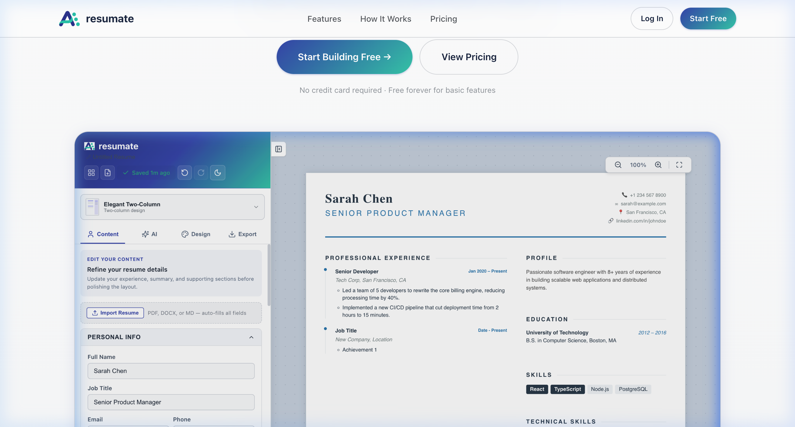
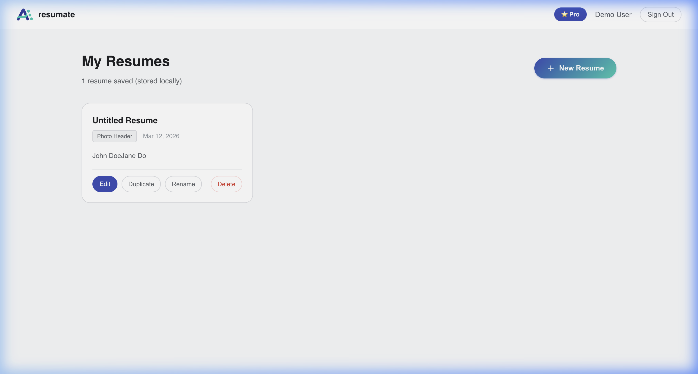
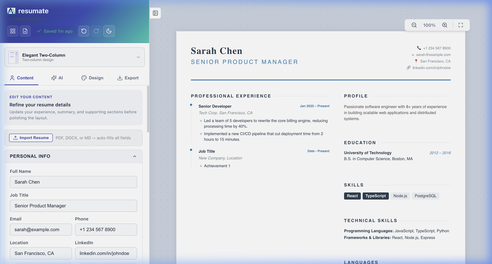

# Professional Resume Builder Ecosystem 📝

A high-performance, browser-based resume customization suite designed for modern professionals. The ecosystem was successfully rewritten from raw HTML to a **React-based architecture (Vite + TS + Zustand)** and is currently evolving into a full **Next.js SaaS Platform** (`resume-builder-saas`).

## 📸 System Screenshots

### 🚀 Next.js SaaS Landing Page


### 📊 User Dashboard & Resume Management


### 📝 Live Editor (Elegant Two-Column Template)


---

## 🚀 Key Features

### 🏢 Multi-Layout Support (9 Templates)
- **v1.0 Classic Minimal**: Minimalist, clean-slate design for high-impact single-page resumes.
- **v2.0 Clean Layout**: Classic professional layout focusing on readability and bottom grid structure.
- **v3.0 Premium Headshot**: Modern sidebar layout with headshot and advanced column management.
- **v4.0 ATS Executive**: Optimized for Application Tracking Systems with metrics alignment.
- **v5.0 Photo Header**: Photo in header with two-column body grid.
- **v6.0 Clean Professional**: Centered header with horizontal dividers.
- **v7.0 Elegant TwoColumn**: Two-column grid with classic serif aesthetics.
- **v8.0 Bold Engineer**: Bold black headers + photo optimized for technical roles.
- **v9.0 Academic**: Serif, education-first design featuring custom GPA & Coursework rendering.

### 🎨 Visual Customization
- **16+ Professional Presets**: Instant color schemes including *California Beaches*, *Cobalt Sky*, *Stone Path*, *Urban Loft*, and *Emerald Odyssey*.
- **Precision Typography**: Per-element font-sizing and family selection (Inter, Roboto, Open Sans, etc.).
- **Dynamic Spacing**: Granular control over page padding (Top/Bottom/Left/Right), item spacing, and section line-height (0.1 increments).

### ✍️ Intelligent Editing
- **Advanced Text Formatting**: Optimized formatting engine using Tiptap for rich-text inline editing without styling conflicts.
- **Interactive Reordering**: Instantly move entire sections or individual job/education blocks up or down.
- **Global State Management**: Powered by Zustand to persist all changes instantly across templates.

### 🤖 AI-Powered Tailoring
- **LLM Integration**: Support for OpenAI, Google Gemini, DeepSeek, and custom providers
- **Smart Resume Tailoring**: Upload your resume and job description to generate tailored versions
- **Multi-Provider Support**: Flexible API configuration with fallback options

### 💾 Persistence & Output
- **Local Auto-Save**: All changes, content, and layout settings are automatically persisted to `localStorage`.
- **Print Optimized**: Clean CSS media queries strictly ensure the output is pixel-perfect for PDF generation and standard A4 printing.

### 🔒 Security Features
- **Environment Variables**: API keys protected via `.env` files
- **Input Validation**: Comprehensive Zod schemas for all user inputs
- **XSS Prevention**: DOMPurify sanitization and CSP headers
- **Error Boundaries**: Graceful error handling with user-friendly messages
- **Rate Limiting**: Client-side protection against API abuse

## 🛠 Setup Instructions

### Prerequisites
- Node.js 18+ and npm/yarn/pnpm
- API keys for LLM providers (optional, for AI features)

### Installation

1. **Clone the repository**
   ```bash
   git clone <repository-url>
   cd Resume_Builder/resume-builder-react
   ```

2. **Install dependencies**
   ```bash
   npm install
   ```

3. **Configure environment variables**
   ```bash
   cp .env.example .env
   ```

   Edit `.env` and add your API keys:
   ```env
   VITE_OPENAI_API_KEY=your_openai_key_here
   VITE_OPENAI_BASE_URL=https://api.openai.com/v1
   VITE_OPENAI_MODEL=gpt-4

   # Optional: Other providers
   VITE_GEMINI_API_KEY=your_gemini_key_here
   VITE_DEEPSEEK_API_KEY=your_deepseek_key_here
   ```

4. **Start development server**
   ```bash
   npm run dev
   ```

5. **Build for production**
   ```bash
   npm run build
   ```

## 📖 Usage Instructions

1. **Start Dev Server**: Run `npm run dev` to start the React application.
2. **Select Template**: Switch between the 9 templates in the Design tab to find your preferred layout.
3. **Edit Content**: Use the **Content** tab to input your work experience, education, and skills. Use the **AI** tab to refine bullet points.
4. **Format**: Make granular typography and color adjustments in the **Design** tab.
5. **Export**: Click the **Print PDF** button to generate your final A4 document.

## 📂 Project Structure

```
Resume_Builder/
├── resume-builder-react/       # Main React application
│   ├── src/
│   │   ├── components/         # React components
│   │   ├── services/           # LLM, file parsing services
│   │   ├── utils/              # Security, validation utilities
│   │   ├── store.ts            # Zustand state management
│   │   └── types.ts            # TypeScript definitions
│   ├── .env.example            # Environment variables template
│   ├── SECURITY.md             # Security documentation
│   └── package.json
├── resume-builder-saas/        # Next.js SaaS version (WIP)
├── templates/                  # Original HTML templates
└── docs/                       # Technical specifications
```

## 🔐 Security

**IMPORTANT**: Never commit API keys to git. See [SECURITY.md](./resume-builder-react/SECURITY.md) for detailed security guidelines.

### Quick Security Checklist
- ✅ Use `.env` files for API keys
- ✅ Add `.env` to `.gitignore`
- ✅ Rotate keys if accidentally exposed
- ✅ Review `SECURITY.md` before deploying

## 🚧 Roadmap

### Current Version (v1.0)
- ✅ 9 professional templates
- ✅ AI-powered resume tailoring
- ✅ Client-side architecture
- ✅ Security hardening

### Upcoming (v2.0 - SaaS)
- 🔄 User authentication (Supabase)
- 🔄 Server-side API key management
- 🔄 Payment integration (Stripe)
- 🔄 Resume version history
- 🔄 Team collaboration features

## ⚖️ License
Personal use for job hunting and career management.

---

*Built with ❤️ for the 2026 Job Hunt.*
