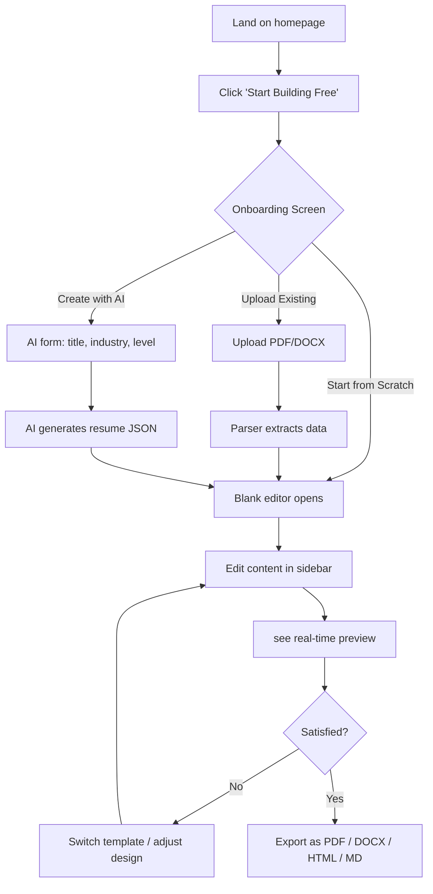
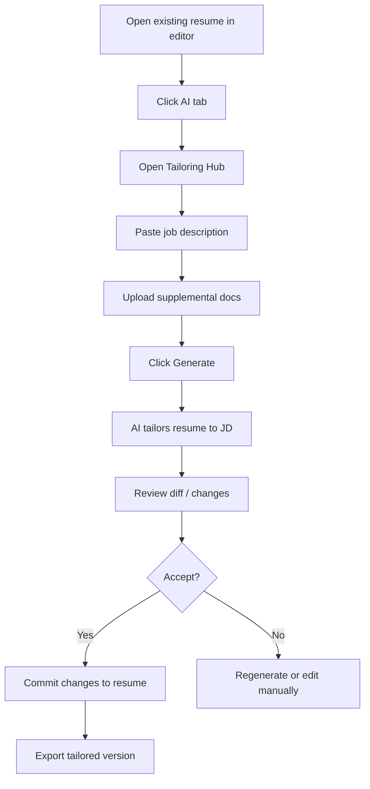

# ResuMate — Product Requirement Document

**Version**: 1.0  
**Date**: March 7, 2026  
**Product**: ResuMate — AI-Powered Resume Builder  
**Status**: MVP Live / v2 Planning

---

## 1. Background & Problem Statement

### The Problem
Job seekers face a fragmented, time-consuming resume creation process:

1. **Generic tools** produce cookie-cutter resumes that all look the same
2. **ATS rejection** — 75% of resumes are filtered out before a human sees them
3. **Tailoring fatigue** — each application requires manual resume customization
4. **Cost barriers** — premium resume builders charge $20–40/month for basic AI features
5. **Privacy concerns** — centralized platforms store sensitive career data on remote servers

### The Opportunity
Build a **privacy-first, AI-powered resume builder** that combines the polish of premium tools with the cost-effectiveness of BYOAPI (Bring Your Own API Key) architecture. Users keep their data local and pay only for the AI tokens they actually consume.

### Product Vision
> *"The last resume builder you'll ever need — professional templates, AI tailoring, and full data ownership, all for free."*

---

## 2. Target Personas

### Persona 1: Career Transitioner — "Sarah"
| Attribute | Detail |
|-----------|--------|
| **Age** | 28–35 |
| **Role** | Mid-level professional switching industries |
| **Pain Point** | Doesn't know how to reframe experience for a new field |
| **Goal** | AI-tailored resume that bridges old experience → new JD |
| **Tech Savvy** | Moderate — comfortable with web apps, not APIs |
| **Willingness to Pay** | Free tier first, Pro if AI tailoring is valuable |

### Persona 2: Active Job Hunter — "Marcus"
| Attribute | Detail |
|-----------|--------|
| **Age** | 25–40 |
| **Role** | Software engineer applying to 10+ jobs/week |
| **Pain Point** | Manually tailoring resumes for each application wastes hours |
| **Goal** | Batch-tailor resumes quickly using AI, export in multiple formats |
| **Tech Savvy** | High — already has API keys, prefers BYOAPI |
| **Willingness to Pay** | Will bring own API key, may pay for cloud sync |

### Persona 3: Student / Entry-Level — "Priya"
| Attribute | Detail |
|-----------|--------|
| **Age** | 20–25 |
| **Role** | Recent grad with limited work experience |
| **Pain Point** | Doesn't know what to include or how to format a resume |
| **Goal** | AI-generated resume from scratch with a professional template |
| **Tech Savvy** | Low-moderate |
| **Willingness to Pay** | Free tier only |

---

## 3. Use Cases

| # | Use Case | Persona | Priority |
|---|----------|---------|----------|
| UC-1 | Create a resume from scratch using a blank template | All | P0 |
| UC-2 | Upload an existing resume (PDF/DOCX/TXT) and edit it | Sarah, Marcus | P0 |
| UC-3 | AI-generate a full resume from job title + industry | Priya | P0 |
| UC-4 | Tailor a resume to a specific job description using AI | Marcus, Sarah | P0 |
| UC-5 | Switch between 9 premium templates without losing data | All | P0 |
| UC-6 | Export resume as PDF, DOCX, HTML, or Markdown | All | P0 |
| UC-7 | Customize colors, fonts, spacing, and section order | All | P1 |
| UC-8 | Save multiple resumes and manage them from a dashboard | Marcus | P1 |
| UC-9 | Print resume directly from the browser | All | P1 |
| UC-10 | Undo/redo changes during editing | All | P1 |

---

## 4. User Stories

### Epic 1: Resume Creation
- **US-1.1**: As a job seeker, I want to start with a blank template so I can build a resume from scratch
- **US-1.2**: As a job seeker, I want to upload my existing PDF/DOCX resume so I can improve it
- **US-1.3**: As a student, I want AI to generate a complete resume from my job title and industry so I don't start from zero
- **US-1.4**: As a user, I want to see my resume update in real-time as I type so I know exactly what the final output looks like

### Epic 2: AI-Powered Features
- **US-2.1**: As a job hunter, I want to paste a job description and have AI tailor my resume to match it
- **US-2.2**: As a user, I want to bring my own API key (OpenAI/Gemini/DeepSeek) so I only pay for tokens I use
- **US-2.3**: As a user, I want AI to follow professional writing standards (no buzzwords, real metrics, natural language)
- **US-2.4**: As a user, I want to review AI-generated changes before committing them

### Epic 3: Templates & Design
- **US-3.1**: As a user, I want to browse 9 templates and preview them before selecting
- **US-3.2**: As a creative professional, I want to customize colors from 20 preset schemes or pick custom colors
- **US-3.3**: As a user, I want to adjust font family, font sizes, line height, spacing, and padding
- **US-3.4**: As a user, I want to show/hide individual sections per template
- **US-3.5**: As a user, I want to reorder resume sections via drag-and-drop

### Epic 4: Export & Output
- **US-4.1**: As a user, I want to export my resume as a pixel-perfect PDF for job applications
- **US-4.2**: As a user, I want to export as DOCX for recruiter edits
- **US-4.3**: As a developer, I want to export as HTML or Markdown for my portfolio
- **US-4.4**: As a user, I want to print my resume directly from the browser

### Epic 5: Data Management
- **US-5.1**: As a user, I want my resume auto-saved locally so I never lose work
- **US-5.2**: As a Pro user, I want cloud sync via Supabase so I can access resumes from any device
- **US-5.3**: As a power user, I want to manage multiple resumes from a dashboard
- **US-5.4**: As a user, I want to undo/redo my changes

---

## 5. User Journey

### Journey 1: First-Time User → Published Resume



### Journey 2: Active Job Hunter → Tailored Resume



---

## 6. User Workflow

### Core Editing Workflow
1. **Entry Point** → Landing page → "Start Building Free" → Editor
2. **Onboarding** → 3 cards: Start from Scratch | Upload Resume | Create with AI
3. **Content Tab** → Edit personal info, summary (rich text), experience, education, skills, languages, certifications
4. **Design Tab** → Select template (9), choose color scheme (20), adjust typography & spacing, toggle section visibility, reorder sections
5. **AI Tab** → Configure API provider (OpenAI/Gemini/DeepSeek), open Tailoring Hub, paste JD, generate tailored version, review & commit
6. **Export Tab** → Choose format (PDF/DOCX/HTML/MD), print, download

---

## 7. Features Specification

### 7.1 Core Features (Shipped)

| Feature | Description | Status |
|---------|-------------|--------|
| **9 Premium Templates** | Classic Minimal, Premium Headshot, Clean Layout, ATS Executive, Photo Header, Clean Professional, Elegant Two Column, Bold Engineer, Academic | ✅ Shipped |
| **20 Color Schemes** | Organized in 3 categories (Professional, Classic, Vibrant) with custom color picker | ✅ Shipped |
| **Real-Time Preview** | Split-pane editor with live resume rendering at 8.5×11 aspect ratio | ✅ Shipped |
| **Resume Import** | Parse PDF (.pdf), Word (.docx), Markdown (.md), and plain text (.txt) | ✅ Shipped |
| **AI Resume Generation** | Generate a complete resume from job title + industry + experience level | ✅ Shipped |
| **AI Resume Tailoring** | Tailor existing resume to a job description via LLM API | ✅ Shipped |
| **BYOAPI Architecture** | Support for OpenAI, Google Gemini, and DeepSeek with custom base URLs | ✅ Shipped |
| **Multi-Format Export** | PDF (browser print), DOCX (docx lib), HTML (styled), Markdown | ✅ Shipped |
| **Undo/Redo** | Full history stack for data, theme, and template changes | ✅ Shipped |
| **Auto-Save** | Zustand persist to localStorage — never lose work | ✅ Shipped |
| **Section Visibility** | Show/hide sections per template (10 toggleable sections) | ✅ Shipped |
| **Section Reorder** | Drag/move sections up/down to customize resume layout | ✅ Shipped |
| **Rich Text Editing** | TipTap-powered editors for summary and achievement bullets (bold, italic, underline, links) | ✅ Shipped |
| **Keyboard Shortcuts** | Ctrl+Z/Y (undo/redo), Ctrl+P (print), Ctrl+S (save acknowledgment) | ✅ Shipped |
| **Photo Upload** | Upload headshot photo for photo-enabled templates | ✅ Shipped |
| **Responsive Sidebar** | Resizable sidebar with collapse/expand | ✅ Shipped |
| **Zoom Controls** | Zoom in/out/fit for the preview pane | ✅ Shipped |

### 7.2 Sections Supported

| Section | Fields | Toggleable |
|---------|--------|------------|
| Personal Info | Full name, title, email, phone, LinkedIn, location, portfolio URL, visa status | Always visible |
| Professional Summary | Rich text (TipTap) | ✅ |
| Experience | Company, location, title, dates, achievements (rich text bullets) | ✅ |
| Education | School, degree, dates, location, GPA, relevant coursework | ✅ |
| Skills | Name + highlighted flag | ✅ |
| Technical Skills | Category + comma-separated skills | ✅ |
| Languages | List of strings | ✅ |
| Certifications | List of strings | ✅ |
| Photo | Base64 headshot image | ✅ |
| Portfolio / Blog | URL + label | ✅ |
| Visa Status | Status + label | ✅ |

### 7.3 Planned Features (Roadmap)

| Feature | Priority | Target |
|---------|----------|--------|
| Cloud sync (Supabase) | P1 | v2.0 |
| Dashboard with multi-resume management | P1 | v2.0 |
| Authentication (Supabase Auth) | P1 | v2.0 |
| Cover letter generation | P2 | v2.1 |
| LinkedIn import | P2 | v2.1 |
| ATS score checker | P2 | v2.1 |
| Collaboration / sharing | P3 | v3.0 |
| Mobile responsive editor | P3 | v3.0 |

---

## 8. UI / UX Requirements

### 8.1 Pages

| Page | Route | Purpose |
|------|-------|---------|
| Landing Page | `/` | Marketing, features, pricing, testimonials, CTA |
| Editor | `/editor` | Core resume editing experience |
| Dashboard | `/dashboard` | Resume list management (future) |
| Login | `/login` | Authentication (future) |
| Pricing | `/pricing` | Detailed pricing plans |

### 8.2 Editor Layout

```
┌────────────────────────────────────────────────────┐
│ [Sidebar Toggle] [Template] [Zoom ±] [Print] [Export]│
├────────────────────┬───────────────────────────────┤
│                    │                               │
│   SIDEBAR (38%)    │     PREVIEW PANE (62%)        │
│                    │                               │
│ ┌───┬───┬──┬────┐  │  ┌─────────────────────────┐  │
│ │Con│Des│AI│Exp │  │  │                         │  │
│ └───┴───┴──┴────┘  │  │    LIVE RESUME          │  │
│                    │  │    (8.5 × 11 paper)     │  │
│ [Form Fields]      │  │                         │  │
│ [Section Controls] │  │                         │  │
│ [Add/Remove/Move]  │  │                         │  │
│                    │  └─────────────────────────┘  │
├────────────────────┴───────────────────────────────┤
│ [AutoSave indicator]                    [Zoom: 75%]│
└────────────────────────────────────────────────────┘
```

### 8.3 Design System

| Token | Value | Usage |
|-------|-------|-------|
| Primary | `#5BBCB4` (Teal) | Brand, CTAs, active states |
| Primary Dark | `#4AA39C` | Hover states, gradients |
| Primary Light | `#7DD3CD` | Highlights, badges |
| Background | `#0f172a` (Dark) | Editor chrome, onboarding |
| Surface | `#ffffff` | Resume paper, cards |
| Text Primary | `#1e293b` | Headings |
| Text Secondary | `#64748b` | Labels, placeholders |
| Error | `#ef4444` | Validation errors |
| Success | `#10b981` | Upload success |

### 8.4 Onboarding UX (3-Card Flow)

The editor opens with a full-screen modal presenting three paths:

1. **Start from Scratch** → Immediately enters blank editor
2. **Upload Existing Resume** → Drag-and-drop zone for PDF/DOCX/MD/TXT files
3. **Create with AI** → Form: Job Title (required), Industry (optional), Experience Level (select: Entry/Mid/Senior/Executive)

---

## 9. Pricing Strategy

| Plan | Price | Features |
|------|-------|----------|
| **Free** | $0/forever | All 9 templates, real-time preview, import/export, custom colors, section reorder, local save |
| **Pro** | $9/month | Everything in Free + AI tailoring (1 built-in/week), unlimited with own API key, cloud sync, priority support |

### Revenue Model
- **Freemium conversion** (Free → Pro at ~5% target)
- **BYOAPI reduces AI cost** — users pay their own LLM provider, reducing operational overhead
- **Zero infrastructure for free tier** — localStorage means no server costs for free users

---

## 10. Success Metrics

| Metric | Target | Measurement |
|--------|--------|-------------|
| **Monthly Active Users** | 5,000 in month 3 | Analytics |
| **Onboarding completion** | >70% | Event tracking |
| **Resume export rate** | >40% of sessions | Event tracking |
| **Free → Pro conversion** | 5% | Stripe |
| **AI tailoring usage** | >30% of Pro users weekly | Event tracking |
| **Template diversity** | >3 unique templates used per user | State analytics |
| **NPS** | >50 | Survey |

---

## 11. Product Roadmap

### Phase 1: MVP (Current — v1.0) ✅
- 9 templates with live preview
- Resume import (PDF/DOCX/MD/TXT)
- AI generation from scratch
- AI tailoring with BYOAPI
- Multi-format export (PDF/DOCX/HTML/MD)
- Full design customization (colors, fonts, spacing, sections)
- Undo/redo, auto-save, keyboard shortcuts

### Phase 2: Platform (v2.0) — Target: Q2 2026
- Supabase authentication & cloud sync
- Multi-resume dashboard with CRUD operations
- Stripe payment integration for Pro plan
- Resume versioning & diff history

### Phase 3: Intelligence (v2.1) — Target: Q3 2026
- ATS score checker with keyword analysis
- Cover letter generation from resume + JD
- LinkedIn profile import
- Batch tailoring (process multiple JDs at once)

### Phase 4: Collaboration (v3.0) — Target: Q4 2026
- Share resume via link
- Collaborative editing
- Mobile-responsive editor
- Resume analytics (views, downloads)

---

## 12. Constraints & Dependencies

| Constraint | Detail |
|-----------|--------|
| **Client-side rendering** | Resume rendering happens entirely in the browser; no server-side PDF generation |
| **PDF export** | Uses `window.print()` — print-to-PDF quality depends on browser |
| **API key security** | Keys stored in localStorage (acceptable for BYOAPI; documented risk) |
| **LLM dependency** | AI features require user-provided API keys; no fallback without one |
| **Supabase optional** | App degrades gracefully to localStorage when Supabase is not configured |

---

## 13. Risks & Mitigations

| Risk | Impact | Likelihood | Mitigation |
|------|--------|------------|------------|
| LLM API breaking changes | AI features stop working | Medium | Abstract via `LLMService` layer; test multiple providers |
| Browser print-to-PDF inconsistency | Resume layout varies by browser | High | Document recommended browsers; consider server-side PDF in v2 |
| localStorage data loss | Users lose resumes on browser clear | Medium | Prominent "Export" CTAs; cloud sync in v2 |
| BYOAPI adoption barrier | Users don't know how to get API keys | Medium | In-app setup wizard with provider-specific instructions |

---

## Appendix: File Structure Reference

```
src/
├── app/                          # Next.js pages
│   ├── page.tsx                  # Landing page
│   ├── editor/page.tsx           # Editor entry point
│   ├── dashboard/page.tsx        # Resume management
│   ├── login/page.tsx            # Authentication
│   ├── pricing/page.tsx          # Pricing plans
│   ├── layout.tsx                # Root layout
│   └── globals.css               # Design system tokens
├── components/
│   ├── editor/
│   │   ├── EditorApp.tsx         # Main editor (1546 lines)
│   │   ├── editor.css            # Editor-specific styles
│   │   └── components/
│   │       ├── OnboardingScreen.tsx   # 3-card entry flow
│   │       ├── TemplateGallery.tsx    # Template browser modal
│   │       └── TailoringHub.tsx       # AI tailoring modal
│   └── FeatureGate.tsx           # Paywall component
├── services/
│   ├── LLMService.ts             # AI tailoring API layer
│   ├── FileParserService.ts      # PDF/DOCX/TXT parser
│   ├── ResumeParserService.ts    # Raw text → structured data
│   └── ResumeService.ts          # CRUD (Supabase + localStorage)
├── store/
│   └── resume-store.ts           # Zustand state (persist + undo/redo)
├── types/
│   └── index.ts                  # All TypeScript interfaces
├── data/
│   └── ColorSchemes.ts           # 20 color scheme presets
├── utils/
│   └── ExportUtils.ts            # MD/HTML/DOCX export functions
├── hooks/
│   └── useKeyboardShortcuts.ts   # Ctrl+Z/Y/P/S handlers
└── lib/
    ├── supabase.ts               # Client SDK setup
    ├── supabase-server.ts        # Server SDK setup
    ├── stripe.ts                 # Payment integration
    └── auth-context.tsx          # Auth provider context
```
