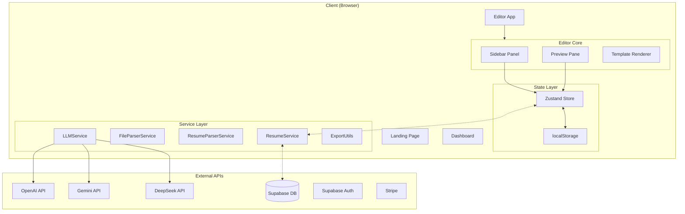
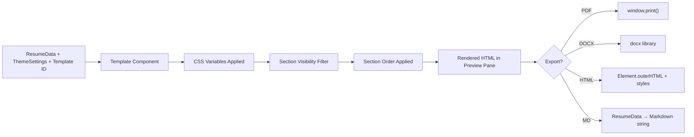
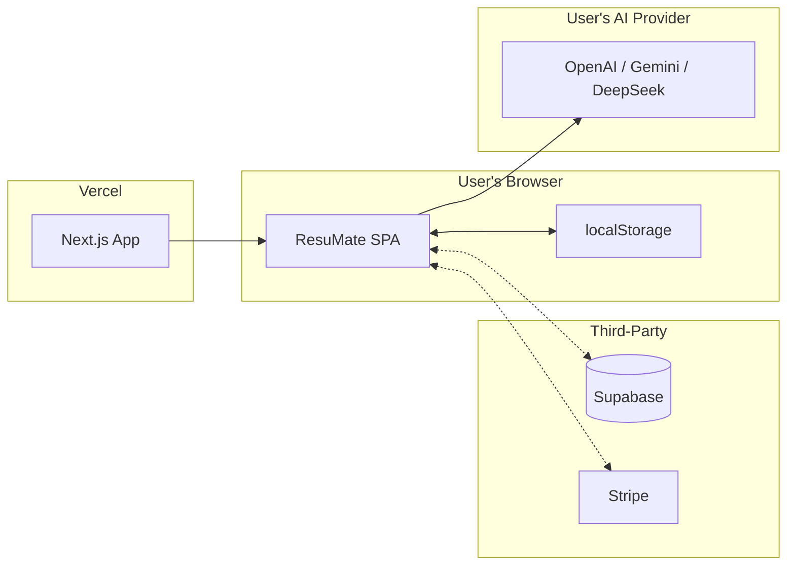

# ResuMate — Technical Design Document

**Version**: 1.0  
**Date**: March 7, 2026  
**Companion**: [Product Requirement Document](file:///Users/boss/.gemini/antigravity/brain/f8a90bbf-e316-474d-84d8-d4f96c0acbb4/prd.md)

---

## 1. System Architecture

### High-Level Architecture



### Architecture Principles

| Principle | Implementation |
|-----------|---------------|
| **Client-first** | All rendering, editing, and state management happen in the browser |
| **Offline-capable** | localStorage persistence means the app works without internet (except AI features) |
| **Progressive enhancement** | Supabase is optional — falls back to localStorage gracefully |
| **BYOAPI** | AI costs are pushed to the user via their own API keys |
| **Zero backend for free tier** | No server needed for non-authenticated usage |

---

## 2. Technology Stack

| Layer | Technology | Rationale |
|-------|-----------|-----------|
| **Framework** | Next.js 14 (App Router) | SSR for landing/marketing pages, CSR for editor |
| **Language** | TypeScript | Type safety across the codebase |
| **State** | Zustand + persist middleware | Lightweight, SSR-safe, built-in localStorage persistence |
| **Rich Text** | TipTap (ProseMirror) | Extensible rich text for summary and bullet editing |
| **Icons** | Lucide React | Tree-shakeable, consistent icon set |
| **Auth** | Supabase Auth | Optional; free tier works without auth |
| **Database** | Supabase PostgreSQL | Optional cloud storage for Pro users |
| **Payments** | Stripe | Subscription billing for Pro plan |
| **PDF Export** | `window.print()` | Zero-dependency, browser-native PDF generation |
| **DOCX Export** | `docx` npm package | Programmatic Word document generation |
| **File Parsing** | Custom (`FileParserService`) | Handles PDF, DOCX, MD, TXT extraction |

---

## 3. Data Models

### 3.1 Core Data Model — `ResumeData`

```typescript
interface ResumeData {
  personalInfo: {
    fullName: string;
    title: string;
    email: string;
    phone: string;
    linkedin: string;
    location: string;
    photo?: string;          // Base64 headshot
    portfolioUrl?: string;
    portfolioLabel?: string;
    visaStatus?: string;
    visaLabel?: string;
  };
  summary: string;           // HTML (TipTap output)
  experience: ExperienceItem[];
  education: EducationItem[];
  skills: SkillItem[];
  technicalSkills: TechnicalSkillCategory[];
  languages: string[];
  certifications: string[];
  sectionVisibility: TemplateVisibility;  // Per-template toggles
}
```

### 3.2 Supporting Interfaces

```typescript
interface ExperienceItem {
  id: string;       // crypto.randomUUID()
  company: string;
  location: string;
  title: string;
  dates: string;
  achievements: string[];  // HTML strings (TipTap)
}

interface ThemeSettings {
  primaryColor: string;
  accentColor: string;
  backgroundColor: string;
  textColor: string;
  fontFamily: string;
  baseFontSize: number;     // px
  headerFontSize: number;
  sectionTitleSize: number;
  lineHeight: number;
  pagePadding: number;
  sectionSpacing: number;
  itemSpacing: number;
  // Template-specific extensions
  sidebarBg?: string;
  sidebarText?: string;
  headshotSize?: number;
  showPageBreak?: boolean;
}

interface ApiSettings {
  openaiKey: string;
  geminiKey: string;
  deepseekKey: string;
  customBaseUrl: string;
  openaiBaseUrl: string;
  geminiBaseUrl: string;
  selectedProvider: 'openai' | 'gemini' | 'custom';
  model: string;
}
```

---

## 4. State Management

### Zustand Store Architecture

```mermaid
graph LR
    subgraph Store["useResumeStore"]
        D[data: ResumeData]
        T[theme: ThemeSettings]
        TM[selectedTemplate: string]
        API[apiSettings: ApiSettings]
        H[history: HistoryStack]
        ON[onboarding: boolean]
        SO[sectionOrder: SectionKey\[\]]
    end
    
    subgraph Persist["localStorage"]
        P["resume-builder-pro-storage"]
    end
    
    Store --> |partialize| Persist
    Persist --> |merge| Store
```

### State Persistence Strategy

The store uses Zustand's `persist` middleware with selective persistence:

```typescript
partialize: (state) => ({
  data: state.data,
  theme: state.theme,
  selectedTemplate: state.selectedTemplate,
  apiSettings: state.apiSettings,
  hasCompletedOnboarding: state.hasCompletedOnboarding,
  uploadedResumeText: state.uploadedResumeText,
  sidebarWidth: state.sidebarWidth,
  sectionOrder: state.sectionOrder,
})
```

> **Not persisted**: `history`, `draftState`, `sourceMaterials` — these are session-only.

### Undo/Redo Implementation

```typescript
interface HistorySnapshot {
  data: ResumeData;
  theme: ThemeSettings;
  selectedTemplate: string;
}

// Stack-based with capped history (50 snapshots)
history: { past: HistorySnapshot[], future: HistorySnapshot[] }

// Triggered on: updateData, updateTheme, setTemplate
// NOT triggered on: apiSettings, sidebarWidth, sectionOrder
```

---

## 5. Service Layer

### 5.1 `LLMService` — AI Integration

**Purpose**: Provides a unified interface for calling LLM APIs using OpenAI-compatible endpoints.

```
LLMService.tailorResume(provider, sourceResume, workHistory, jobDescription)
  → returns JSON string of tailored ResumeData
```

**Key Design Decisions**:
- Uses OpenAI-compatible `/chat/completions` endpoint for all providers (Gemini exposes this via `/v1beta/openai`)
- System prompt enforces "no-buzzword" professional writing standard
- JSON-only output format — strips any markdown code fences from response
- `response_format: { type: 'json_object' }` used for OpenAI to guarantee structured output

### 5.2 `FileParserService` — Resume Import

**Purpose**: Extracts raw text from uploaded files.

| Format | Method |
|--------|--------|
| `.pdf` | `pdf.js` extraction |
| `.docx` | XML unzip + text node extraction |
| `.md` / `.txt` | Direct UTF-8 read |

### 5.3 `ResumeParserService` — Text → Data

**Purpose**: Converts raw text into structured `ResumeData` using regex-based section detection.

### 5.4 `ResumeService` — CRUD Layer

**Purpose**: Abstracts persistence between Supabase (Pro) and localStorage (Free).

```typescript
// Graceful degradation pattern:
if (!isSupabaseConfigured || !supabase) {
  return localStorageFallback();
}
return supabaseOperation();
```

---

## 6. Template Rendering Engine

### Template Registry

| ID | Name | Layout | Category |
|----|------|--------|----------|
| `classic` | Classic Minimal | Single column | Classic |
| `premium` | Premium Headshot | Two column (sidebar + main) | Modern |
| `clean` | Clean Layout | Single column | Modern |
| `ats` | ATS Executive | Single column | Classic |
| `photo` | Photo Header | Banner + single column | Creative |
| `clean_prof` | Clean Professional | Single column | Classic |
| `elegant` | Elegant Two Column | Two column | Modern |
| `bold` | Bold Engineer | Banner + single column | Creative |
| `academic` | Academic | Single column | Classic |

### Rendering Pipeline



### Design Customization Layers

1. **Template** → Defines structural layout (single-col, two-col, banner)
2. **Color Scheme** → 20 presets + custom picker → maps to `ThemeSettings`
3. **Typography** → Font family, 4 font sizes, line height
4. **Spacing** → Page padding, section spacing, item spacing
5. **Section Visibility** → Per-template show/hide state stored in `sectionVisibility`
6. **Section Order** → Global `sectionOrder: SectionKey[]` reorderable array

---

## 7. AI Integration Architecture

### Two AI Flows

| Flow | Entry Point | Service | Use Case |
|------|-------------|---------|----------|
| **Generate** | `OnboardingScreen` → "Create with AI" | Inline fetch (no LLMService) | Create resume from scratch |
| **Tailor** | `TailoringHub` → "Generate" | `LLMService.tailorResume()` | Tailor existing resume to JD |

### Provider Configuration

```
┌─────────────────────────────────────────────┐
│ apiSettings (Zustand Store)                 │
├─────────────────────────────────────────────┤
│ selectedProvider: 'openai' | 'gemini' | 'custom' │
│ openaiKey / geminiKey / deepseekKey         │
│ openaiBaseUrl / geminiBaseUrl / customBaseUrl│
│ model: string (e.g. 'gpt-4o')              │
└─────────────────────────────────────────────┘
              │
              ▼
┌─────────────────────────────────────────────┐
│ OpenAI-compatible /chat/completions endpoint│
│ - OpenAI: api.openai.com/v1                │
│ - Gemini: generativelanguage.googleapis.com │
│ - Custom: user-provided base URL            │
└─────────────────────────────────────────────┘
```

### AI Response Schema

Both flows expect the LLM to return a JSON matching `ResumeData`:

```json
{
  "personalInfo": { ... },
  "summary": "...",
  "experience": [{ "id": "1", ... }],
  "education": [{ "id": "1", ... }],
  "skills": [{ "id": "1", "name": "...", "isHighlighted": true }],
  "technicalSkills": [{ "category": "...", "skills": ["..."] }],
  "languages": ["..."],
  "certifications": ["..."]
}
```

---

## 8. Export Pipeline

### PDF Export
- Uses `window.print()` with a print-specific CSS stylesheet
- Preview pane's resume element is isolated during print
- Limitation: Quality depends on browser; Chrome recommended

### DOCX Export
- Uses `docx` npm package to programmatically build Word documents
- Maps `ResumeData` → `Document` → `Packer.toBlob()` → `saveAs()`
- Includes section headers with bottom borders, tabbed date alignment

### HTML Export
- Captures `element.outerHTML` of the rendered resume
- Inlines all CSS stylesheets for self-contained output
- Adds print-friendly `@media print` styles

### Markdown Export
- Converts `ResumeData` → Markdown string with `#` headers and `- ` bullets
- Highlighted skills wrapped in `**bold**`

---

## 9. Security Considerations

| Concern | Approach |
|---------|----------|
| **API key storage** | Stored in localStorage (client-side only). Documented trade-off: convenience vs. security. Keys never sent to any server we control. |
| **Data privacy** | Free tier = 100% client-side. No data leaves the browser. |
| **Supabase RLS** | Row-level security on `resumes` table: `user_id = auth.uid()` |
| **CORS** | LLM API calls go directly from browser → provider (no proxy) |
| **XSS in TipTap** | TipTap sanitizes HTML by default; custom extensions are minimal |

---

## 10. Performance Considerations

| Area | Approach |
|------|----------|
| **Bundle size** | Tree-shake Lucide icons; lazy-load TipTap, docx, pdf.js |
| **Re-renders** | Zustand selective subscribers minimize unnecessary re-renders |
| **Preview rendering** | Debounced updates (250ms) to avoid layout thrashing |
| **File parsing** | Web Workers for PDF.js to avoid blocking the main thread |
| **History stack** | Capped at 50 snapshots to limit memory usage |

---

## 11. Deployment Architecture



### Environment Variables

```env
# Optional — app works without these
NEXT_PUBLIC_SUPABASE_URL=
NEXT_PUBLIC_SUPABASE_ANON_KEY=
NEXT_PUBLIC_STRIPE_PUBLISHABLE_KEY=
STRIPE_SECRET_KEY=
```

---

## Appendix: Key File Reference

| File | Lines | Purpose |
|------|-------|---------|
| [EditorApp.tsx](file:///tmp/resume-builder-saas/src/components/editor/EditorApp.tsx) | 1,546 | Main editor component — sidebar, preview, all handlers |
| [resume-store.ts](file:///tmp/resume-builder-saas/src/store/resume-store.ts) | 345 | Zustand store with persist + undo/redo |
| [LLMService.ts](file:///tmp/resume-builder-saas/src/services/LLMService.ts) | 135 | AI tailoring API abstraction |
| [OnboardingScreen.tsx](file:///tmp/resume-builder-saas/src/components/editor/components/OnboardingScreen.tsx) | 455 | 3-card onboarding + AI generation |
| [TailoringHub.tsx](file:///tmp/resume-builder-saas/src/components/editor/components/TailoringHub.tsx) | 601 | JD-based resume tailoring modal |
| [ExportUtils.ts](file:///tmp/resume-builder-saas/src/utils/ExportUtils.ts) | 217 | MD/HTML/DOCX export functions |
| [ResumeService.ts](file:///tmp/resume-builder-saas/src/services/ResumeService.ts) | 182 | CRUD with Supabase/localStorage fallback |
| [types/index.ts](file:///tmp/resume-builder-saas/src/types/index.ts) | 154 | All TypeScript interfaces |
| [ColorSchemes.ts](file:///tmp/resume-builder-saas/src/data/ColorSchemes.ts) | 300 | 20 color scheme presets |
| [globals.css](file:///tmp/resume-builder-saas/src/app/globals.css) | 642 | Design system tokens + global styles |
